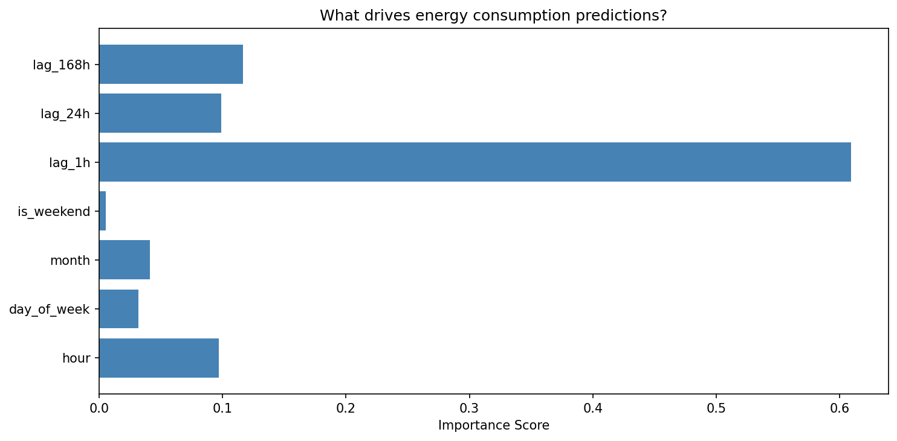
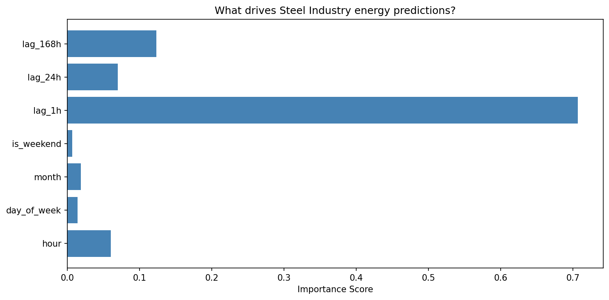
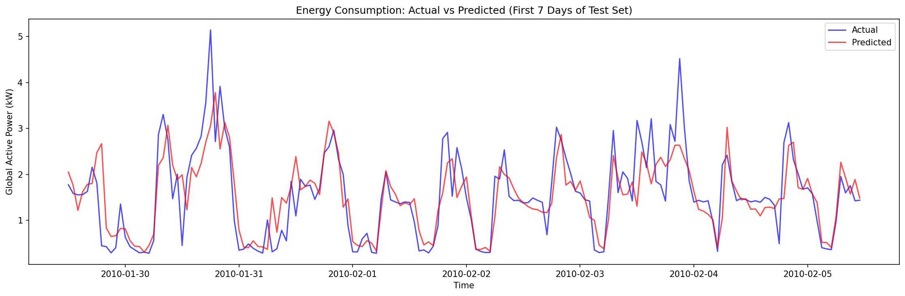
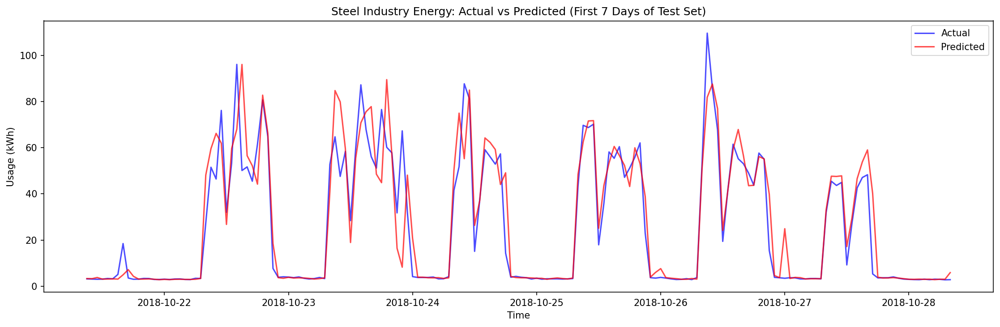

# Energy Consumption Predictor

Predicting energy consumption from time-series sensor data using Random Forest.
Built as part of a learning path to apply AI in Building Management Systems (BMS).

## Datasets
- UCI Household Power Consumption (household energy, per-minute readings)
- Steel Industry Energy Consumption (industrial energy, 15-minute readings)

## Approach
Time-series feature engineering (lag features, hour, day, week patterns)
trained on a Random Forest Regressor with time-based train/test split.

## Results
| Dataset | MAE | Baseline MAE | Improvement |
|---------|-----|--------------|-------------|
| Household | 0.347 kW | 0.638 kW | 45.6% |
| Steel Industry | 5.568 kWh | 26.469 kWh | 79.0% |

## Feature Importance

## Predictions vs Actual

