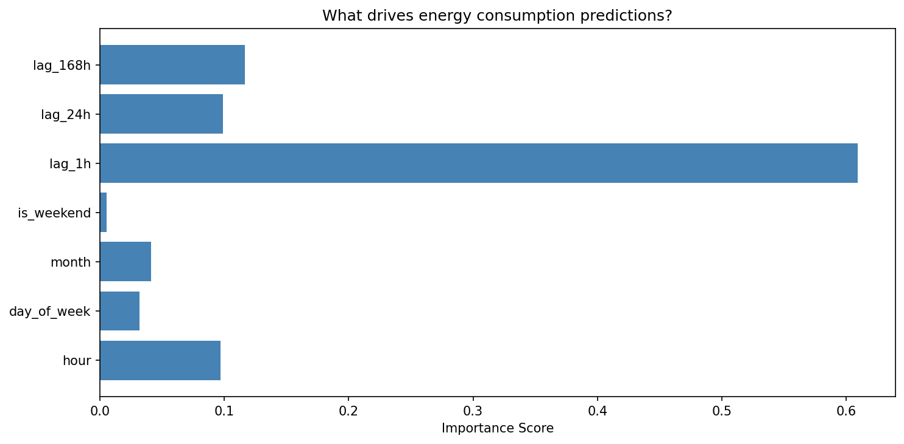
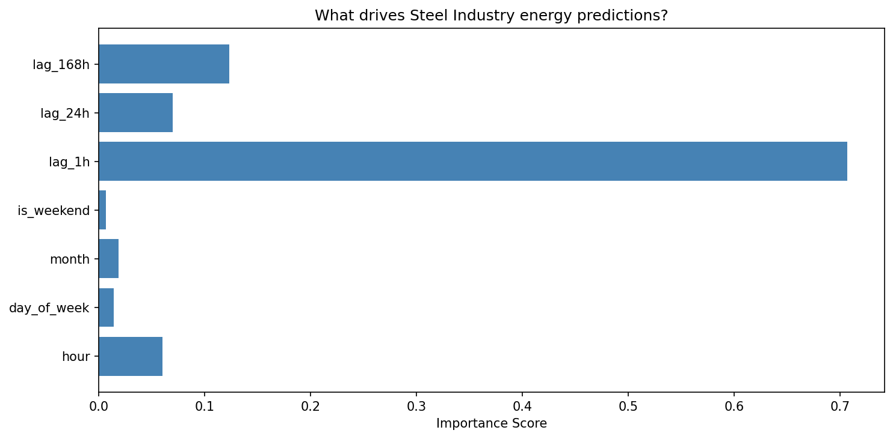
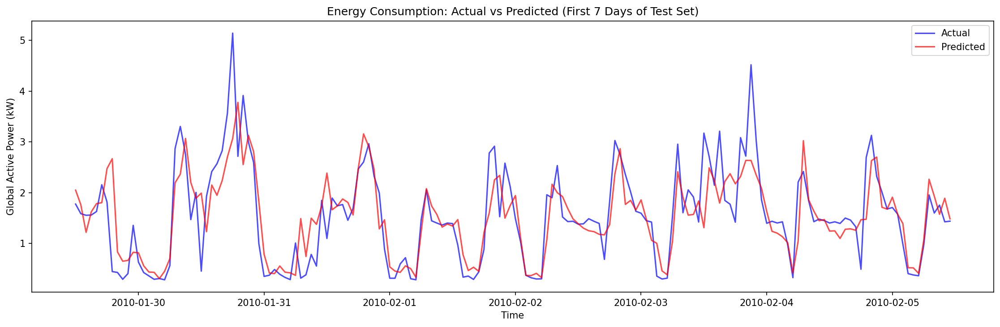
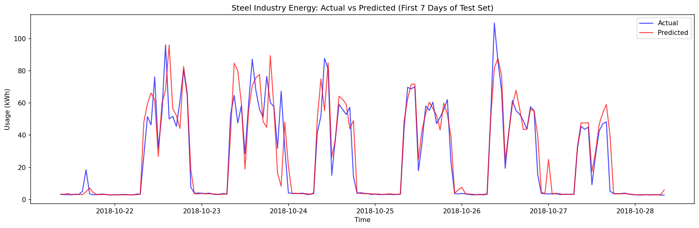

# Energy Consumption Predictor

Predicting energy consumption from time-series sensor data using machine learning.
Built as part of a learning path to apply AI in Building Management Systems (BMS).

This is a **notebook-driven** project. All analysis and modeling live in Jupyter notebooks under `notebooks/`.

## Requirements

- Python 3.10+

## Setup

```bash
git clone https://github.com/geeorgepaull/Energy-Consumption-Predictor.git
cd Energy-Consumption-Predictor
python -m venv .venv

# Windows
.venv\Scripts\activate

# macOS / Linux
source .venv/bin/activate

pip install -r requirements.txt
```

## Data

Download the datasets listed in [Data/README.md](Data/README.md) and place them in the `Data/` folder.

## Run

Start Jupyter from the project root:

```bash
jupyter notebook notebooks/
```

Open and run the notebooks in order:

1. `01-household_power_consumption.ipynb` — household energy forecasting with Random Forest
2. `02-steel_industry.ipynb` — steel industry forecasting with a multi-model comparison (Random Forest, XGBoost, Linear Regression) and ordinal vs cyclic time encoding

## Project Structure

```
Energy-Consumption-Predictor/
├── Data/                  # Local datasets (not committed; see Data/README.md)
├── notebooks/             # Analysis notebooks
├── feature_importance_*.png
├── predictions_*.png
├── requirements.txt
├── LICENSE
└── README.md
```

## Datasets

- [UCI Household Power Consumption](https://archive.ics.uci.edu/dataset/235/individual+household+electric+power+consumption) — household energy, per-minute readings
- [UCI Steel Industry Energy Consumption](https://archive.ics.uci.edu/dataset/851/steel+industry+energy+consumption) — industrial energy, 15-minute readings

## Approach

**Household:** Time-series feature engineering (lag features, hour/day/week patterns) trained on a Random Forest Regressor with a time-based train/test split.

**Steel Industry:** Hourly aggregation with autoregressive lag features. A controlled experiment compares Random Forest, XGBoost, and Linear Regression under two temporal encodings — standard ordinal features (`hour`, `day_of_week`, `month`) and cyclic sine/cosine transforms.

## Results

| Dataset | MAE | Baseline MAE | Improvement |
|---------|-----|--------------|-------------|
| Household | 0.347 kW | 0.638 kW | 45.6% |
| Steel Industry | 5.568 kWh | 26.469 kWh | 79.0% |

## Feature Importance




## Predictions vs Actual




## License

MIT — see [LICENSE](LICENSE).
